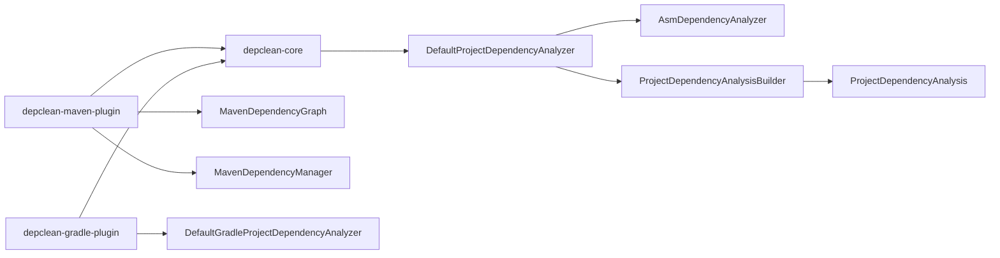

# SE2115 Project 1 Analysis - DepClean

## 1. Repository Overview

**Repository analyzed:** `D:\depclean`

**System purpose:** DepClean is a Java dependency analysis tool. It detects unused, transitive, and inherited dependencies and can generate debloated dependency files or machine-readable reports.

**Main modules found:**

- `depclean-core`: shared analysis engine. It scans bytecode, builds used-class information, maps classes back to dependencies, and produces dependency usage results.
- `depclean-maven-plugin`: Maven plugin adapter. It integrates the core analysis with Maven projects, Maven dependency graphs, POM debloating, JSON output, and Maven plugin parameters.
- `depclean-gradle-plugin`: Gradle plugin prototype. It contains Gradle-specific dependency collection, analysis, JSON output, and build-file writing logic.

**Important structural note:** the root `pom.xml` only includes `depclean-core` and `depclean-maven-plugin` as Maven modules. The Gradle plugin is a separate Gradle build and is not part of the root Maven reactor.

## 2. Architecture Overview

The architecture is adapter-based:

1. User runs a plugin goal or task.
2. Plugin adapter collects build-system-specific project data.
3. Core analyzer scans compiled project classes, test classes, dependency classes, and source imports.
4. The analysis builder classifies dependencies into used/unused and direct/transitive/inherited groups.
5. Optional outputs are generated, such as debloated POM/build files, JSON, and call graph CSV.

### Main execution flow - Maven

`DepCleanMojo.execute()` creates a `MavenDependencyManager`, passes it into `DepCleanManager`, then calls `execute()`.

`DepCleanManager.execute()`:

- skips execution if configured
- skips Maven modules with `pom` packaging
- copies dependency artifacts into a build dependency directory
- decompresses dependencies
- builds a `ProjectContext`
- runs `DefaultProjectDependencyAnalyzer`
- optionally fails the build for unused dependencies
- optionally writes debloated POM, JSON, or call graph output

### Main execution flow - Gradle

`DepCleanGradleAction.execute()` collects Gradle configurations, resolved dependencies, artifacts, unresolved dependencies, declared dependencies, dependency sizes, and class output paths. It then invokes `DefaultGradleProjectDependencyAnalyzer`, classifies artifacts into usage categories, applies ignore rules, prints results, and optionally writes output files.

## 3. Package / Module Diagram



## 4. Tool-Based Analysis Evidence

### Build and tests

Command run:

```bash
mvn test
```

Result:

- Reactor build passed.
- `depclean-core`: 42 tests passed.
- `depclean-maven-plugin`: 2 tests passed.
- Total: 44 tests passed, 0 failures, 0 errors.
- Checkstyle reported 0 violations for the Maven reactor modules.

### Build warnings observed

The Maven plugin descriptor generation reported dependency-scope warnings:

- `org.apache.maven:maven-xml:jar:4.0.0-rc-3:compile`
- `org.apache.maven:maven-api-xml:jar:4.0.0-rc-3:compile`
- `org.apache.maven:maven-api-annotations:jar:4.0.0-rc-3:compile`

These are expected to use `provided` scope for Maven plugins.

Other warnings:

- Javadoc links in `DepCleanMojo.java` were reported as unresolvable because HTML anchor syntax is used inside `@see`.
- SLF4J reported missing `StaticLoggerBinder` during tests and defaulted to a no-operation logger.

### Gradle plugin validation

Command attempted:

```bash
cd depclean-gradle-plugin
.\gradlew.bat test
```

Result:

- The first attempt was blocked by network restrictions while downloading the Gradle distribution.
- After network access was allowed, Gradle started but failed before compiling because the build requires a Java 17 toolchain and this machine currently exposes Java 24.
- Error summary: Gradle could not find a Java installation matching `languageVersion=17`, and toolchain download repositories are not configured.

This means the separate Gradle plugin module was analyzed manually, but not fully validated in this environment.

## 5. Manual Code Quality Findings

### Finding 1: Large class with too many responsibilities

File: `depclean-gradle-plugin/src/main/java/se/kth/depclean/DepCleanGradleAction.java`

Evidence:

- The class has 727 lines.
- `execute()` starts at line 69 and performs project configuration, dependency resolution, file copying, size calculation, decompression, analysis, classification, filtering, printing, validation, and output generation.

Why this is problematic:

- The class is difficult to test in isolation.
- Small changes to output formatting, filtering, or Gradle dependency collection all affect the same class.
- The Maven implementation is cleaner because build-system interaction is wrapped behind `DependencyManagerWrapper`, while the Gradle implementation mixes adapter and analysis orchestration.

Recommended refactoring:

- Extract `GradleDependencyCollector`.
- Extract `GradleDependencyClassifier`.
- Extract `GradleResultPrinter`.
- Extract `GradleOutputWriter`.

### Finding 2: Static mutable state in Gradle action

File: `depclean-gradle-plugin/src/main/java/se/kth/depclean/DepCleanGradleAction.java`

Evidence:

- `ArtifactConfigurationMap` is static mutable state at line 49.
- `SizeOfDependencies` is static mutable state at line 52.

Why this is problematic:

- Gradle can run tasks in parallel or reuse plugin classes across projects.
- Static mutable state can leak data between projects or task executions.
- It makes tests order-dependent.

Recommended refactoring:

- Convert both maps to instance fields.
- Clear or recreate them for each execution.
- Pass them explicitly to collaborators that need them.

### Finding 3: Known TODOs describe unresolved correctness problems

File: `depclean-gradle-plugin/src/main/java/se/kth/depclean/DepCleanGradleAction.java`

Evidence:

- Line 193: used transitive dependencies induced by inherited dependencies should be considered inherited.
- Line 242: ignored direct dependencies should also affect corresponding transitive/inherited dependencies.

Why this is problematic:

- These are not formatting TODOs. They describe classification correctness gaps.
- The output may report dependencies in the wrong category.
- Ignore rules may produce misleading reports.

Recommended refactoring:

- Model dependency classification as a graph traversal problem instead of repeated set subtraction.
- Add fixture tests for inherited-direct, inherited-transitive, ignored-direct, and ignored-transitive cases.

### Finding 4: Assertions are used for production null handling

File: `depclean-gradle-plugin/src/main/java/se/kth/depclean/DepCleanGradleAction.java`

Evidence:

- Line 168: `assert projectDependencyAnalysis != null;`

Why this is problematic:

- Java assertions are disabled by default.
- If the analyzer unexpectedly returns null, later code can fail with a less useful `NullPointerException`.

Recommended refactoring:

- Replace the assertion with `Objects.requireNonNull(projectDependencyAnalysis, "...")` or throw a `GradleException` with a clear message.

### Finding 5: Console printing is mixed into core logic

Files:

- `depclean-core/src/main/java/se/kth/depclean/core/DepCleanManager.java`
- `depclean-core/src/main/java/se/kth/depclean/core/analysis/model/ProjectDependencyAnalysis.java`
- `depclean-gradle-plugin/src/main/java/se/kth/depclean/DepCleanGradleAction.java`
- `depclean-gradle-plugin/src/main/java/se/kth/depclean/utils/DependencyUtils.java`
- `depclean-gradle-plugin/src/main/java/se/kth/depclean/utils/json/JsonResultWriter.java`

Evidence:

- Several production classes call `System.out.println`.
- Core result printing is embedded inside `ProjectDependencyAnalysis.print()`.

Why this is problematic:

- It couples domain classes to terminal output.
- It makes output harder to test.
- It prevents plugin adapters from controlling how results are logged.

Recommended refactoring:

- Keep analysis results as data.
- Move output formatting to printer classes.
- Use Maven/Gradle logger adapters instead of direct console printing.

### Finding 6: Broad exception handling hides failure details

Files:

- `depclean-core/src/main/java/se/kth/depclean/core/DepCleanManager.java`
- `depclean-core/src/main/java/se/kth/depclean/core/model/Dependency.java`
- `depclean-gradle-plugin/src/main/java/se/kth/depclean/DepCleanGradleAction.java`

Evidence:

- `DepCleanManager` catches `IOException | NullPointerException` while copying `libs`.
- `Dependency.calculateSize()` catches `IllegalArgumentException | NullPointerException` and returns `0L`.
- Gradle action also catches `IOException | NullPointerException` while copying libraries.

Why this is problematic:

- `NullPointerException` catch blocks usually hide programming errors.
- Returning zero size for invalid files can make reports silently inaccurate.
- Users may not know when dependency metadata is incomplete.

Recommended refactoring:

- Validate nullable inputs before use.
- Catch only expected exceptions.
- Include the file path and operation in error messages.

### Finding 7: Equality and hash code are inconsistent

File: `depclean-core/src/main/java/se/kth/depclean/core/model/Dependency.java`

Evidence:

- `equals()` compares `groupId`, `dependencyId`, `version`, and `scope`.
- `hashCode()` hashes only `groupId`, `dependencyId`, and `version`.

Why this is problematic:

- This does not break the strict Java contract because equal objects still have equal hash codes, but it creates unnecessary hash collisions when the same dependency appears under different scopes.
- The project relies heavily on sets and maps, so cleaner hashing would improve clarity and possibly performance.

Recommended refactoring:

- Include `scope` in `hashCode()`.
- Add tests for same GAV with different scopes.

### Finding 8: Redundant Optional usage

File: `depclean-maven-plugin/src/main/java/se/kth/depclean/graph/MavenDependencyGraph.java`

Evidence:

- `toDepCleanDependency(org.apache.maven.model.Dependency dependency)` returns `Optional.of(artifact).get()` inside a loop.

Why this is problematic:

- `Optional.of(x).get()` adds no value over returning `x`.
- It makes the code look more complex than it is.

Recommended refactoring:

- Replace `return Optional.of(artifact).get();` with `return artifact;`.

## 6. Suggested Refactoring Plan

### Small, safe PR candidate

Start with low-risk maintainability changes:

1. Replace `Optional.of(artifact).get()` with `return artifact`.
2. Fix `Dependency.hashCode()` to include `scope` and add a test.
3. Replace production `assert` with explicit error handling.
4. Fix Maven plugin Javadoc `@see` warnings.

This is suitable for an upstream PR because it is narrow, easy to review, and behavior-preserving.

### Larger follow-up PR candidate

Refactor `DepCleanGradleAction`:

1. Extract dependency collection.
2. Extract result classification.
3. Extract result printing.
4. Remove static mutable maps.
5. Add Gradle functional tests for TODO correctness cases.

This is higher value but larger and should be split into multiple commits.

## 7. Before vs After Comparison Template

Use this table after implementing a refactor:

| Area | Before | After | Expected behavior |
| --- | --- | --- | --- |
| Dependency equality | Hash omitted scope | Hash includes scope | Same analysis results |
| Maven graph conversion | Redundant Optional usage | Direct return | Same dependency graph |
| Gradle null handling | Java assertion | Explicit exception | Clearer failure message |
| Output code | Domain classes print directly | Printer/logger classes format output | Same visible output |

## 8. Functional Validation Plan

Use these commands as validation evidence:

```bash
mvn test
```

Expected current result:

- Build success.
- 44 tests passed.
- 0 Checkstyle violations for Maven reactor modules.

For Gradle plugin changes, also run:

```bash
cd depclean-gradle-plugin
.\gradlew.bat test
```

If network access is unavailable, note that dependency downloads may fail and include that as an environment limitation.

Current environment note: the Gradle test command also requires a Java 17 toolchain. It failed on this machine because only Java 24 was detected by Gradle.

## 9. Final Report Checklist Against PDF

- Repository overview: covered in section 1.
- Architecture overview: covered in section 2.
- Package/module diagram: covered in section 3.
- Entry point and execution flow: covered in section 2.
- Manual issues: covered in section 5.
- Tool-based findings: covered in section 4.
- Refactoring approach: covered in section 6.
- Before vs after comparison: template in section 7.
- Functional validation: covered in section 8.
- PR proposal: use the small safe PR candidate from section 6.
