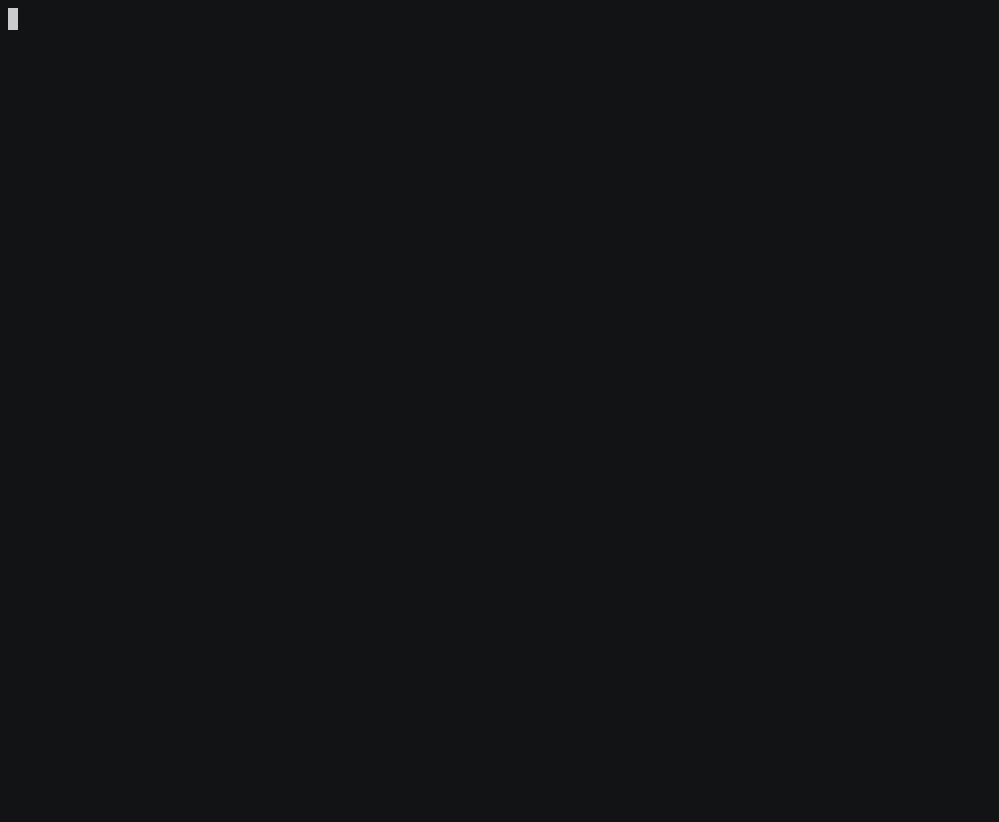

# DepClean 

[](https://github.com/ASSERT-KTH/depclean/actions/workflows/build.yml)
[](https://sonarcloud.io/summary/new_code?id=ASSERT-KTH_depclean)
[](https://sonarcloud.io/summary/new_code?id=ASSERT-KTH_depclean)
[](https://sonarcloud.io/summary/new_code?id=ASSERT-KTH_depclean)
[](https://sonarcloud.io/summary/new_code?id=ASSERT-KTH_depclean)
[](https://search.maven.org/search?q=g:se.kth.castor%20AND%20a:depclean*)
[](LICENSE.md)
[](https://sonarcloud.io/summary/new_code?id=ASSERT-KTH_depclean)
[](https://sonarcloud.io/summary/new_code?id=ASSERT-KTH_depclean)
[](https://sonarcloud.io/summary/new_code?id=ASSERT-KTH_depclean)
[](https://sonarcloud.io/summary/new_code?id=ASSERT-KTH_depclean)
[](https://sonarcloud.io/summary/new_code?id=ASSERT-KTH_depclean)
[](https://sonarcloud.io/summary/new_code?id=ASSERT-KTH_depclean)
[](https://codecov.io/gh/ASSERT-KTH/depclean)

## Table of Contents

- [What is DepClean?](#what-is-depclean)
- [Usage](#usage)
- [Optional Parameters](#optional-parameters)
- [How does DepClean work?](#how-does-depclean-work)
- [Gradle Plugin](#gradle-plugin)
- [Installing and building from source](#installing-and-building-from-source)
- [Citation](#citation)
- [Contributing](#contributing)
- [License](#license)
- [Funding](#funding)

## What is DepClean?

**DepClean** is a Maven plugin that automatically detects and removes unused dependencies declared in a project's `pom.xml` file, imported transitively through other dependencies, and even those inherited from a parent POM.

It can be executed via the command line as a Maven goal or seamlessly integrated into the Maven build lifecycle (e.g., in CI/CD pipelines). 

Importantly, **DepClean does *not* modify your source code or original `pom.xml` file**.

### Main Features

* Automatically detects and removes unused dependencies from the `pom.xml`, including those inherited from parent projects.
* Analyzes bytecode of any Java version, up to the latest release, ensuring compatibility with modern Java features.
* Runs on Java 8 and above: the plugin ships Java 8 bytecode, so it works on legacy toolchains while still analyzing modern bytecode.
* Generates a clean and minimal `pom.xml`, free from unused dependencies.
* Produces detailed, per-dependency usage reports.
* Offers fine-grained configuration options to tailor the analysis and cleaning process.
* Integrates directly into the Maven build lifecycle.
* Handles multi-module Maven projects out of the box.
* Ignores some dependencies used only via reflection (e.g., frameworks like Spring or Hibernate).
* Includes support for annotation processors.
* Analyzes fat JARs, shaded dependencies, and repackaged libraries.

For a visual overview of how DepClean works and what it can do for your project, check out the companion project: [**depclean-web**](https://github.com/ASSERT-KTH/depclean-web).

✨ **DepClean is the result of academic research** conducted at [KTH Royal Institute of Technology](https://www.kth.se/en) in Sweden. It was introduced in the paper:
["A Comprehensive Study of Bloated Dependencies in the Maven Ecosystem"](http://arxiv.org/pdf/2001.07808) ([DOI: 10.1007/s10664-020-09914-8](https://doi.org/10.1007/s10664-020-09914-8))

## Usage

DepClean requires Maven 3.9+ and runs on any JVM from Java 8 upwards, regardless of the Java version your project targets.

Configure the `pom.xml` file of your Maven project to use DepClean as part of the build:

```xml
<plugin>
  <groupId>se.kth.castor</groupId>
  <artifactId>depclean-maven-plugin</artifactId>
  <version>2.1.0</version>
  <executions>
    <execution>
      <goals>
        <goal>depclean</goal>
      </goals>
    </execution>
  </executions>
</plugin>
```

Or you can run DepClean directly from the command line (the project needs to be compiled first, including its test classes):

```bash
cd {PATH_TO_MAVEN_PROJECT}
mvn test-compile
mvn se.kth.castor:depclean-maven-plugin:2.1.0:depclean
```

The examples above use the latest release published to [Maven Central](https://central.sonatype.com/artifact/se.kth.castor/depclean-maven-plugin). To try the latest snapshot instead, [build from source](#installing-and-building-from-source).

Let's see an example of running DepClean in the project [Apache Commons Numbers](https://github.com/apache/commons-numbers/tree/master/commons-numbers-examples/examples-jmh)!



## Optional Parameters

The Maven plugin can be configured with the following additional parameters.

| Name                       |     Type      | Description                                                                                                                                                                                                                                                                                                                                                                                                                 |
| :------------------------- | :-----------: | :-------------------------------------------------------------------------------------------------------------------------------------------------------------------------------------------------------------------------------------------------------------------------------------------------------------------------------------------------------------------------------------------------------------------------- |
| `<ignoreDependencies>`     | `Set<String>` | A regex expression matching dependencies to be ignored by DepClean during the analysis (i.e., considered as used). This is useful to bypass incomplete result caused by bytecode-level analysis. **For example:** `-DignoreDependencies="net.bytebuddy:byte-buddy:.*","com.google.guava.*"` ignores dependencies with `groupId:artifactId` equals to `net.bytebuddy:byte-buddy` and `groupId` equals to `com.google.guava`. |
| `<ignoreScopes>`           | `Set<String>` | Add a list of scopes, to be ignored by DepClean during the analysis. Useful to not analyze dependencies with scopes that are not needed at runtime. **Valid scopes are:** `compile`, `provided`, `test`, `runtime`, `system`, `import`. An Empty string indicates no scopes (default).                                                                                                                                      |
| `<ignoreTests>`            |   `boolean`   | If this is true, DepClean will not analyze the test classes in the project, and, therefore, the dependencies that are only used for testing will be considered unused. This parameter is useful to detect dependencies that have `compile` scope but are only used for testing. **Default value is:** `false`.                                                                                                              |
| `<createPomDebloated>`     |   `boolean`   | If this is true, DepClean creates a debloated version of the pom without unused dependencies called `pom-debloated.xml`, in the root of the project. **Default value is:** `false`.                                                                                                                                                                                                                                         |
| `<createResultJson>`       |   `boolean`   | If this is true, DepClean creates a JSON file of the dependency tree along with metadata of each dependency. The file is called `depclean-results.json`, and is located in the `target` directory of the project. **Default value is:** `false`.                                                                                                                                                                            |
| `<createCallGraphCsv>`     |   `boolean`   | If this is true, DepClean creates a CSV file with the static call graph of the API members used in the project. The file is called `depclean-callgraph.csv`, and is located in the `target` directory of the project. **Default value is:** `false`.                                                                                                                                                                        |
| `<failIfUnusedDirect>`     |   `boolean`   | If this is true, and DepClean reported any unused direct dependency in the dependency tree, the build fails immediately after running DepClean. **Default value is:** `false`.                                                                                                                                                                                                                                              |
| `<failIfUnusedTransitive>` |   `boolean`   | If this is true, and DepClean reported any unused transitive dependency in the dependency tree, the build fails immediately after running DepClean. **Default value is:** `false`.                                                                                                                                                                                                                                          |
| `<failIfUnusedInherited>`  |   `boolean`   | If this is true, and DepClean reported any unused inherited dependency in the dependency tree, the build fails immediately after running DepClean. **Default value is:** `false`.                                                                                                                                                                                                                                           |
| `<skipDepClean>`           |   `boolean`   | Skip plugin execution completely. **Default value is:** `false`.                                                                                                                                                                                                                                                                                                                                                            |

You can integrate DepClean in your CI/CD pipeline.
For example, if you want to fail the build in the presence of unused direct dependencies, while ignoring all the dependency scopes except the
`compile`, use the following plugin configuration.

```xml
<plugin>
  <groupId>se.kth.castor</groupId>
  <artifactId>depclean-maven-plugin</artifactId>
  <version>2.1.0</version>
  <executions>
    <execution>
      <goals>
        <goal>depclean</goal>
      </goals>
      <configuration>
        <failIfUnusedDirect>true</failIfUnusedDirect>
        <ignoreScopes>provided,test,runtime,system,import</ignoreScopes>
      </configuration>
    </execution>
  </executions>
</plugin>
```

Of course, it is also possible to execute DepClean with parameters directly from the command line. The previous example can be executed directly as follows:

```bash
mvn se.kth.castor:depclean-maven-plugin:2.1.0:depclean -DfailIfUnusedDirect=true -DignoreScopes=provided,test,runtime,system,import
```

## How does DepClean work?

DepClean runs before executing the `package` phase of the Maven build lifecycle. It statically collects all the types
referenced in the project under analysis as well as in its declared dependencies. Then, it compares the types that the
project actually uses in the bytecode with respect to the class members belonging to its dependencies.

With this usage information, DepClean constructs a new `pom.xml` based on the following steps:

1. add all used transitive dependencies as direct dependencies
2. remove all unused direct dependencies
3. exclude all unused transitive dependencies

If all the tests pass, and the project builds correctly after these changes, then it means that the dependencies identified as bloated can be removed. DepClean produces a file named `pom-debloated.xml`, located in the root of the project, which is a clean version of the original `pom.xml` without bloated dependencies.

## Gradle Plugin

A prototype Gradle plugin providing a `debloat` task for Gradle-based Java projects is available in this repository. It is not yet published to a plugin portal and must be built from source. See the [DepClean Gradle plugin README](depclean-gradle-plugin/README.md) for usage and configuration details.

## Installing and building from source

Prerequisites:

- [Java OpenJDK 21](https://openjdk.java.net) or above to build (the Maven plugin itself targets Java 8 bytecode and runs on Java 8+)
- No Maven installation needed — the Maven wrapper is included

In a terminal clone the repository and switch to the cloned folder:

```bash
git clone https://github.com/ASSERT-KTH/depclean.git
cd depclean
```

Then run the following command to build the application and install the plugin locally:

```bash
./mvnw clean install
```

## Citation

If you use DepClean in academic work, please cite the original paper (see also [CITATION.cff](CITATION.cff)):

```bibtex
@article{SotoValero2021,
  title     = {A comprehensive study of bloated dependencies in the {Maven} ecosystem},
  author    = {Soto-Valero, C{\'e}sar and Harrand, Nicolas and Monperrus, Martin and Baudry, Benoit},
  journal   = {Empirical Software Engineering},
  volume    = {26},
  number    = {3},
  pages     = {1--44},
  year      = {2021},
  doi       = {10.1007/s10664-020-09914-8}
}
```

## Contributing

Contributions are welcome! See the [contributing guidelines](CONTRIBUTING.md) for how to build the project and submit a pull request. Feel free to open an [issue](https://github.com/ASSERT-KTH/depclean/issues) for bug reports or feature suggestions — for security vulnerabilities, please follow the [security policy](SECURITY.md) instead. The [Gradle plugin](depclean-gradle-plugin/README.md) in particular is actively looking for contributors.

## License

Distributed under the MIT License. See [LICENSE](LICENSE.md) for more information.

## Funding

DepClean is partially funded by the [Wallenberg Autonomous Systems and Software Program (WASP)](https://wasp-sweden.org).


